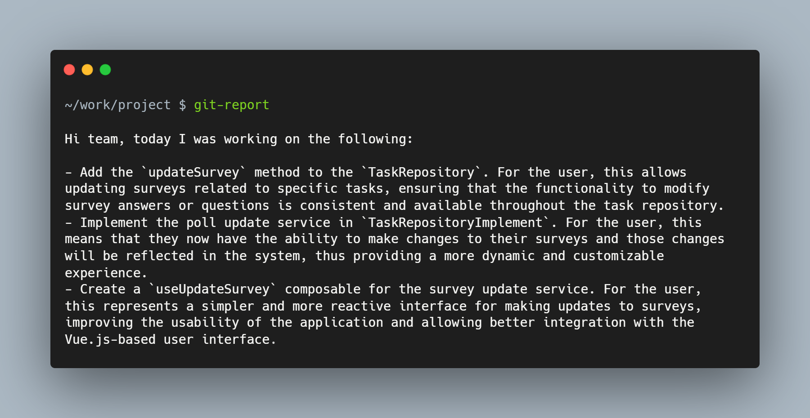
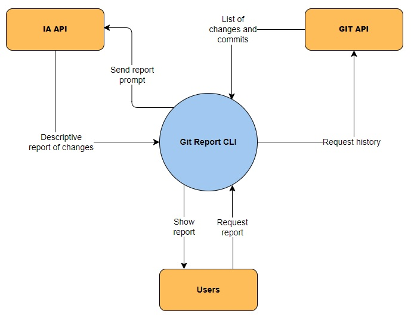

# Git Report CLI

## Table of Contents

- [Description](#description)
- [Goals](#goals)
- [Non-Goals](#non-goals)
- [Design](#design)
  - [Context](#context)
  - [Language](#language)
  - [AI API](#ai-api)
  - [Git API](#git-api)

## Description

I aim to develop a Command Line Interface (CLI) that **harnesses text generation models** like ChatGPT **to automate the creation of daily reports using information extracted from Git** commit and change history.

Upon conducting a brief Internet search, **_no existing tools_** were identified to address **_this particular requirement_**. This gap in available solutions suggests a unique and specific need within the developer community, presenting an excellent **opportunity to craft a valuable tool**.

An intriguing parallel can be drawn with the ChatGPT-based **Pull Request (PR) review bots** pioneered by **CNCF's WasmEdge community**. For further details, you can [click here](https://www.cncf.io/blog/2023/06/06/a-chatgpt-powered-code-reviewer-bot-for-open-source-projects/). This project exemplifies the potential applications and benefits that an AI-driven CLI tool for report generation could offer to developers.

## Goals

- Create a CLI tool.
- Delegate report building to text generation AI's such as ChatGPT or Bard.
- Multiplatform support: Windows, Linux and macOS.
- Allow configurations such as language, target authors and files to be skipped.

## Non-Goals

- Console chat with IA tools, for this there are already dedicated applications.
- Integration with version control software other than _`git`_.

## Design

### Context

The application maintains constant interaction with the following two services:

- **GIT:** This service acts as an intermediary, providing information about the changes made in the repository on which the application is executed.
- **AI API:** This service is responsible for constructing the report based on the selected changes and properly included prompts.

In essence, the CLI serves as a bridge between these two tools, enabling seamless integration and collaborative functioning. Additionally, the **user** plays an active role in configuring parameters that define the characteristics of the desired changes to be reported.

### Language

**Rust** is chosen for the implementation due to the following aspects:

- **Distribution:** Rust, being a compiled language, does not require a runtime. Instead, the code transforms into a binary that can be directly executed on the chosen platform, offering a simpler solution for achieving multi-platform support.
- **Performance:** Compiled Rust code is closer to machine language, and due to extensive validation during compilation, it eliminates runtime checks that interpreted languages must perform. This results in improved performance.
- **Maintainability:** Rust's type system, memory management, and mandatory error handling make it a highly secure and robust language for programming. Rust focuses on error prevention rather than correction, meaning that bugs are typically caught during development rather than in production, enhancing the reliability of the final product developed in Rust.
- **Packages:** Rust boasts a rich ecosystem of packages, known as crates, easily manageable. Notably, **[Clap](https://docs.rs/clap/latest/clap/)** stands out as an excellent tool for building CLIs.

The following readings serve as references to delve deeper into the advantages of Rust:

- [The Rust CLI Book](https://rust-cli.github.io/book/index.html)
- [TurboRepo Migration: Go to Rust](https://vercel.com/blog/turborepo-migration-go-rust)
- [Rewriting Our CLI Tool in Rust](https://blog.railway.app/p/rust-cli-rewrite)
- [Why use Rust over Python for CLI?](https://www.reddit.com/r/rust/comments/wbtioi/why_use_rust_over_python_for_cli/)

### AI API

As of the date of writing this section, December 2023, there are several text generation models apparently capable of fulfilling the desired task, of which **ChatGPT 4** from OpenAI, **Gemini Pro** from Google and **Claude** from Anthropic in their API versions will be considered for the project. The following table summarizes the main features of these services:

<table>
<thead>
<tr>
<th scope="col">Features</th>
<th scope="col">ChatGPT 4</th>
<th scope="col">Gemini Pro</th>
<th scope="col">Claude</th>
</tr>
</thead>
<tbody>
<tr>
<th scope="row">Production ready</th>
<td>✔ Yes</td>
<td>❌ No</td>
<td>✔ Yes</td>
</tr>
<tr>
<th scope="row">Free layer</th>
<td>❌ No</td>
<td>✔ Yes</td>
<td>✔ Yes</td>
</tr>
<tr>
<th scope="row">Confidentiality</th>
<td>✔ Yes</td>
<td>❌ No</td>
<td>✔ Yes</td>
</tr>
<tr>
<th scope="row">Input price *</th>
<td>$ 0.01 / 1K tokens</td>
<td>$ 0</td>
<td>$ 0.024 / 1K tokens</td>
</tr>
<tr>
<th scope="row">Output price</th>
<td>$ 0.01 / 1K tokens</td>
<td>$ 0</td>
<td>$ 0.03 / 1K tokens</td>
</tr>
<tr>
<th scope="row">Others</th>
<td>
<ul style="padding-left: 10px">
<li>Individual and corporate account.</li>
<li>Possibility to sign a DPA if necessary.</li>
<li>Only the propmts and outputs are stored for one month.</li>
</ul>
</td>

<td>
<ul style="padding: 10px">
<li>For the time being, it is only a test account.</li>
</ul>
</td>

<td>
<ul style="padding: 10px">
<li>Individual and corporate accounts.</li>
<li>Data privacy for corporate accounts only.</li>
</ul>
</td>
</tr>

<tr>
<th scope="row">Links</th>
<td>
<ul style="padding-left: 10px">
<li><a href="https://openai.com/pricing" target="_blank" rel="noreferrer noopener">https://openai.com/pricing</a></li>
<li><a href="https://openai.com/enterprise-privacy" target="_blank" rel="noreferrer noopener">https://openai.com/enterprise-privacy</a></li>
<li><a href="https://platform.openai.com/docs/guides/text-generation/managing-tokens" target="_blank" rel="noreferrer noopener">https://platform.openai.com/docs/guides/text-generation/managing-tokens</a></li>
</ul>
</td>

<td>
<ul style="padding-left: 10px">
<li><a href="https://cloud.google.com/vertex-ai/docs/generative-ai/start/quickstarts/quickstart-multimodal" target="_blank" rel="noreferrer noopener">https://cloud.google.com/vertex-ai/docs/generative-ai/start/quickstarts/quickstart-multimodal</a></li>
</ul>
</td>

<td>
<ul style="padding-left: 10px">
<li><a href="https://www.anthropic.com/product" target="_blank" rel="noreferrer noopener">https://www.anthropic.com/product</a></li>
<li><a href="https://anthropic.com/pricing" target="_blank" rel="noreferrer noopener">https://anthropic.com/pricing</a></li>
<li><a href="https://docs.anthropic.com/claude/reference/input-and-output-sizes" target="_blank" rel="noreferrer noopener">https://docs.anthropic.com/claude/reference/input-and-output-sizes</a></li>
</ul>
</td>
</tr>
</tbody>
</table>

\* The models may differ in their definition in tokens, so a direct comparison of prices is not recommended in principle.

#### Confidentiality

Given that the source code of a software product is confidential information, only services ensuring the privacy of interacting information should be considered. Therefore, with this initial filter, only ChatGPT 4 and Claude in their paid versions will be taken into account. In the future, when the Gemini Pro service has a production version, a reassessment of this analysis should be considered.

#### Pricing and Costs

Service prices depend on the quantity of "tokens" sent. As mentioned in the clarification note, these prices are likely to be different for each model. OpenAI recommends considering a token as equivalent to 4 characters, and Anthropic does not specify a guideline in its documentation. Therefore, the first will be taken as a reference for both. Considering that input texts (prompts) will be the most extensive when consuming these services, it is evident that the price of ChatGPT 4 is much more favorable. It represents costs approximately 50% lower than those offered by Claude.

It is also worth noting that ChatGPT 4 is the latest and most powerful model offered by OpenAI, hence it has the highest price. However, if needed, one can opt for less powerful and more affordable versions.

#### Documentation and Toolchain

Both services provide clear guides and documentation that any developer can follow to implement their applications.

Finally, for the reasons stated above, the initial implementation will be done with **OpenAI** and its **ChaptGPT 4 Turbo** model.

### Git API

Communication with the repository can be achieved using two tools:

- **Git CLI:** This application is commonly used to manage a repository from the command line.
- **Git2-rs:** It is a Rust wrapper around the **`libgit2`** library, which is a direct implementation of Git in C. It exposes a high-level API of Git's internal functions.

The most significant difference between these approaches is that in **Git CLI**, all information is obtained as a **`String`**. This necessitates the development of a parsing method for plain text returned by commands such as **`git log`**, aiming to create more easily manipulable data structures. On the other hand, **Git2-rs** exposes structures like **`Repository`** and **`Commit`**, abstracting away such concerns. However, in terms of usage, these structures might be more confusing as they are built based on Git's internal functionalities.

For flexibility and performance reasons, it is highly recommended to use **Git2-rs** since it operates directly from the code without requiring external calls to the operating system. Moreover, it provides functionalities with greater control and detail, enabling future application growth without much complication. However, given the current requirements, few of its features would be utilized, introducing unnecessary complexity. Hence, it is temporarily dismissed but remains a tool to consider as functionalities grow in complexity and/or better performance is required.

Useful links:

- [https://docs.rs/git2/latest/git2/](https://docs.rs/git2/latest/git2/)
- [https://git-scm.com/book/en/v2/Appendix-B%3A-Embedding-Git-in-your-Applications-Command-line-Git](https://git-scm.com/book/en/v2/Appendix-B%3A-Embedding-Git-in-your-Applications-Command-line-Git)
- [https://git-scm.com/book/en/v2/Appendix-B%3A-Embedding-Git-in-your-Applications-Libgit2](https://git-scm.com/book/en/v2/Appendix-B%3A-Embedding-Git-in-your-Applications-Libgit2)
